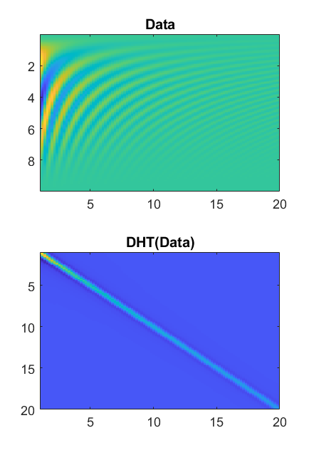

# Discrete-Hankel-Transform

The code follows principles similar to those of the Discrete Fourier Transform (DFT), including key properties such as orthogonality, invertibility, and the standard discrete shift, modulation, multiplication, and convolution rules. This contrasts with earlier definitions of the Discrete Hankel Transform (DHT), which approximated the continuous integral transform but lacked these essential properties.

This implementation is based on the work of Baddour, N. and Chouinard, U., 2017. Journal of Open Research Software, 5(1), p.4. [doi.org/10.5334/jors.82](https://doi.org/10.5334/jors.82), with several improvements. The computation of the Y matrix has been vectorized, resulting in an approximately 20-fold speed increase. Additionally, optional zero-padding and array input support have been introduced, making the functionality more consistent with MATLAB’s FFT. In addition, the Bessel zeros and the Y matrix are computed only once. The Bessel zeros calculation also utilizes the updated algorithm by Jason Nicholson.

